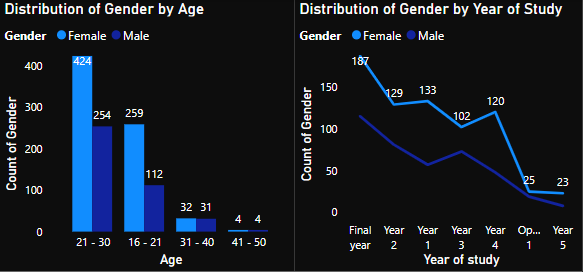
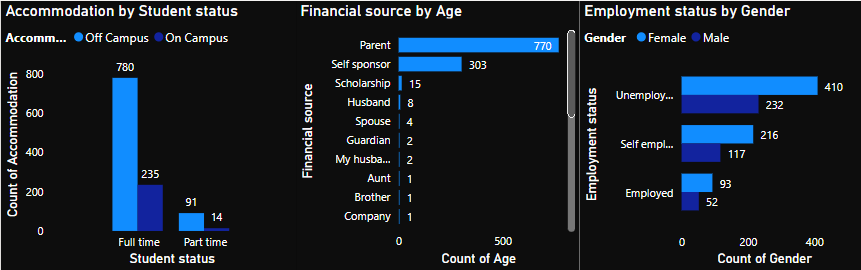
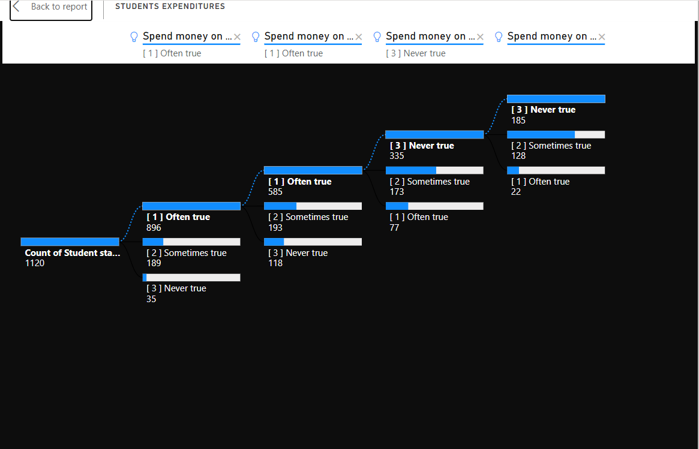
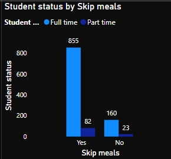
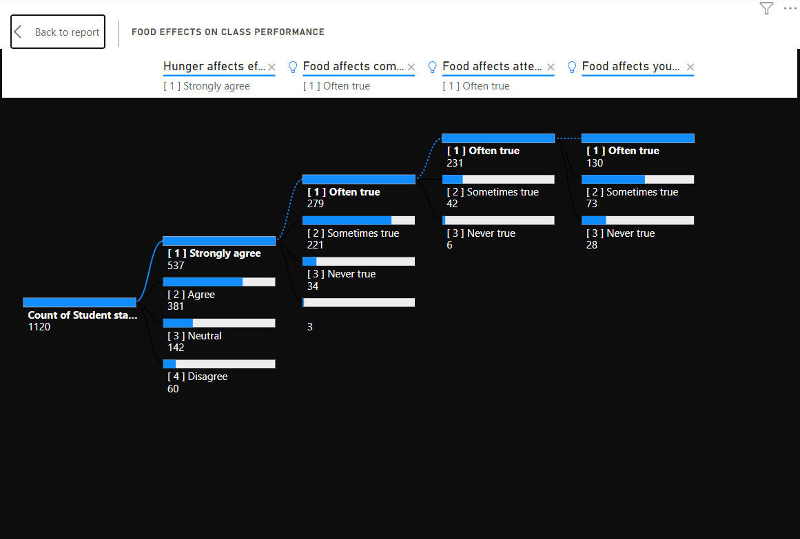
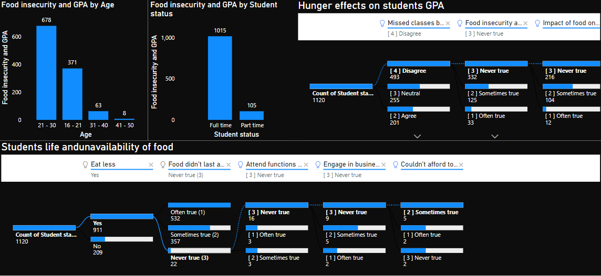

# SpU_foodbank_case_study

## Introduction

This is a power BI project on the need to set up a foodbank at Springforth University(SpU) campus in collaboration with United Nations, Educational, Scientific and Cultural Organization(UNESCO). The project is to analyse and derive insights on the justification as to why foodbank should be set up at Sringforth University. 

Food insecurity is an increasingly pressing issue in university campuses, with many students facing inadequate access to food due to financial constraints. This is also true at Springforth University, where a survey of 1200 students showed that nearly two-thirds of the students were facing food insecurity. This report will provide evidence-based justification for the establishment of a foodbank at Springforth University, in order to better address the issue of food insecurity among its student.

## Problem statement

- why foodbank should be set up at Springforth University

## Visualization

The report comprises 6 pages
  1. Gender, age and year of study
  2. Accomodation, financial source and employment status
  3. Students expenditures
  4. Students skipping meals
  5. Students class performance
  6. Food insecurity and GPA
  

### Gender, age and year of study

Out of the 1200 students interviewed during the course of the survey, 719 of them were females across all the age groups which also showed more females dominating from year 1 through the final year except for option 1 and year 5.
 
 
 ### Accomodation, financial source and employment status
 
 
 
Majority of the interviewed students were full time students that stayed outside the campus. Only 13% of the students are employed, and as a result of this, 69% of them are been sponsored by their parents while 27% of them cater for themselves. 
  
  
### Students expenditures

80% and 65% of the students responded often true in spending money on study materials and transportation to and from school respectively. 

### Students skipping meals

84% of the students skip meals, 61% between the age group of 21 – 30 were faced with food insecurity.

### Students class performance

On the food effects on class performance, 48% and 52% of them strongly agree that hunger affects their effectiveness and reduce their level of comprehension in class respectively.

### Food insecurity and GPA

While 44% of them disagreed to missing classes because of hunger, 23% were neutral and 18% agree that lack of food affects their GPA
49% of the students said its sometimes true that food insecurity affects their GPA, 71% attested never true to it meaning they still struggled to maintain good results despite lack of food.
81% of them eat less, out of which 58% have no money to buy food, 63% engage in several businesses to be able to buy food, while 52% said they attend functions with the intention of getting free food.

## Potential Benefits of Establishing a Foodbank

Establishing a foodbank at Springforth University would provide numerous benefits to students. The most obvious benefit would be to provide immediate access to food for students facing food insecurity. It would also provide an opportunity for students to learn about nutrition and healthy eating habits, as well as provide a space for students to connect with one another and build community. It would also increase students attentiveness and comprehension in class thereby increasing their overall performance and consequently good grades. 

## Conclusion

This report has provided an evidence-based justification for the establishment of a foodbank at Springforth University. The survey results showed that nearly two-thirds of the students surveyed were facing food insecurity. The report also provided an overview of the potential benefits of establishing a foodbank.  With this information, it is clear that establishing a foodbank at Springforth University would be a beneficial and necessary step in addressing food insecurity among its student body.

